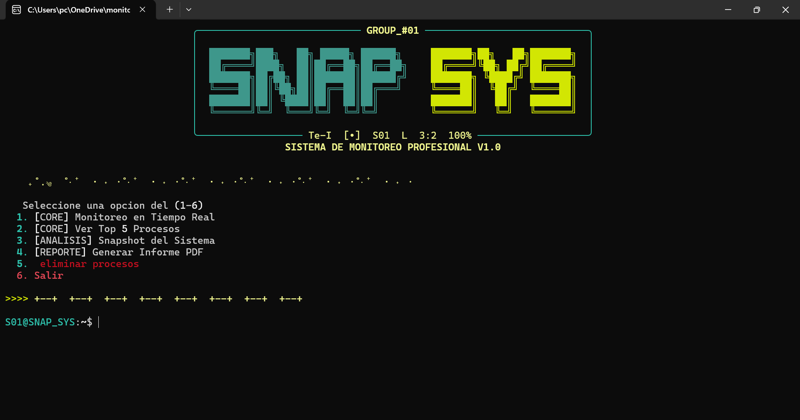

# Monitor de Actividad del Sistema
- Debe generar reportes para la detección temprana de anomalías internas.
- Se requiere un script que registre uso de CPU, memoria y procesos.
- 

## Especificaciones:
- Lenguaje principal: Python.

### GRUPO #1 - TRADUCTORES E INTERPRETES (SECCIÓN 1)
